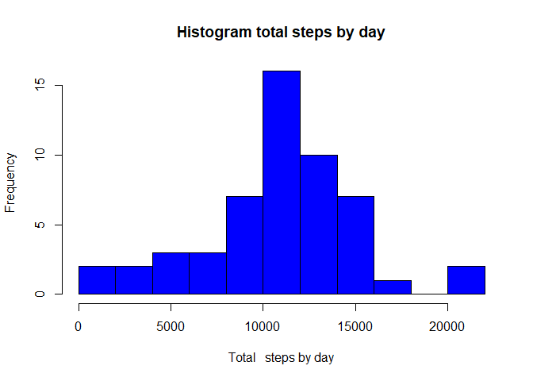
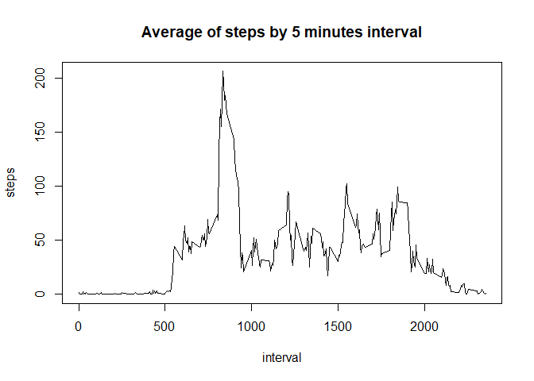
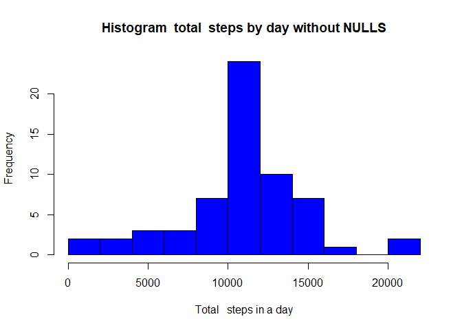
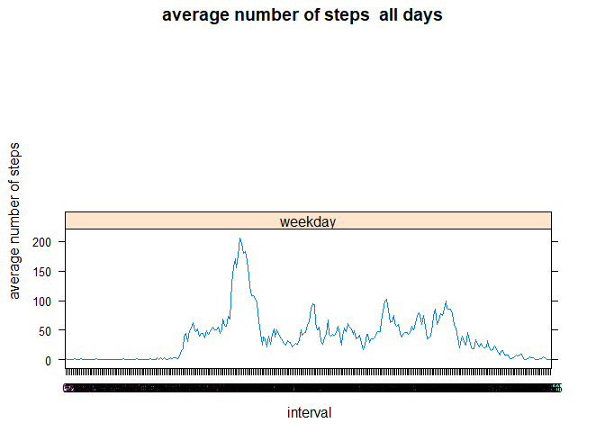

INIT
====

##### Loading and preprocessing the data. Show any code that is needed to:

1.  Load the data (i.e. read.csv())
2.  Process/transform the data (if necessary) into a format suitable for
    your analysis

<!-- -->

    library("data.table")
    library(ggplot2)
    library(tidyr)
    library(lattice)

    # Set working directory
    setwd("C:/jesus/curso5/Practica1")
    # If ref-folder doesnt exist, it must be created (a working directory must be selected first form R editor)
    if (!file.exists("./ficheros")) {
            dir.create("./ficheros")
    }

    #Init variables
    origen <-"https://d396qusza40orc.cloudfront.net/repdata%2Fdata%2Factivity.zip"
    destino <- "./ficheros/ficheros.zip"
    fileSource <- "./ficheros/activity.csv"

    #Unzip file downloaded
    if (!file.exists(destino )) {
            download.file(origen , destino , method = "curl")
            unzip(destino , overwrite = T, exdir = "./ficheros")
    }
    data_ini <- read.csv(fileSource,na.strings = "NA")
    #Supress NA 's 
    lines <- complete.cases(data_ini)
    data_def <- data_ini[lines,]
    head(data_def,4)

    ##     steps       date interval
    ## 289     0 2012-10-02        0
    ## 290     0 2012-10-02        5
    ## 291     0 2012-10-02       10
    ## 292     0 2012-10-02       15

##### What is mean total number of steps taken per day?(For this part of the assignment, you can ignore the missing values in the dataset):

1.  Calculate the total number of steps taken per day

<!-- -->

    #Sum steps by date
    data_def_steps_day <- aggregate(steps ~ date, data=data_def, FUN=sum)
    head(data_def_steps_day,14)

    ##          date steps
    ## 1  2012-10-02   126
    ## 2  2012-10-03 11352
    ## 3  2012-10-04 12116
    ## 4  2012-10-05 13294
    ## 5  2012-10-06 15420
    ## 6  2012-10-07 11015
    ## 7  2012-10-09 12811
    ## 8  2012-10-10  9900
    ## 9  2012-10-11 10304
    ## 10 2012-10-12 17382
    ## 11 2012-10-13 12426
    ## 12 2012-10-14 15098
    ## 13 2012-10-15 10139
    ## 14 2012-10-16 15084

1.  If you do not understand the difference between a histogram and a
    barplot, research the difference between them. Make a histogram of
    the total number of steps taken each day

<!-- -->

    #Histogram
    hist(data_def_steps_day$steps, breaks=10, col="blue", main="Histogram total steps by day", xlab="Total   steps by day")

    #dev.copy(png, file = "./plot1.png");
    #dev.off();

1.  Calculate and report the mean and median of the total number of
    steps taken per day

<!-- -->

    #Mean
    mean(data_def_steps_day$steps)

    ## [1] 10766.19

    #Median
    median(data_def_steps_day$steps)

    ## [1] 10765

##### What is the average daily activity pattern?

1.  Make a time series plot (i.e. type = “l”) of the 5-minute interval
    (x-axis) and the average number of steps taken, averaged across all
    days (y-axis)

<!-- -->

    #aggregate steps by interval and plot the INFO
    data_def_interval_5 <- aggregate(steps~ interval,data=data_def,FUN=mean)
    plot(data_def_interval_5, type = "l", main="Average of steps by 5 minutes interval")

    #dev.copy(png, file = "./plot2.png");
    #dev.off();

1.  Which 5-minute interval, on average across all the days in the
    dataset, contains the maximum number of steps?

<!-- -->

    max_step_interval_5 <- data_def_interval_5[which.max(data_def_interval_5$steps),]
    max_step_interval_5

    ##     interval    steps
    ## 104      835 206.1698

##### Imputing missing values

Note that there are a number of days/intervals where there are missing
values (coded as NA). The presence of missing days may introduce bias
into some calculations or summaries of the data.

1.  Calculate and report the total number of missing values in the
    dataset (i.e. the total number of rows with NAs)

<!-- -->

    sum(is.na(data_ini$steps))

    ## [1] 2304

1.  Devise a strategy for filling in all of the missing values in the
    dataset. The strategy does not need to be sophisticated. For
    example, you could use the mean/median for that day, or the mean for
    that 5-minute interval, etc. –&gt;Option: or the mean for that
    5-minute interval

2.  Create a new dataset that is equal to the original dataset but with
    the missing data filled in.

<!-- -->

    data_without_na <- data_ini

    for (i in 1:nrow(data_without_na) ){
     #If steps are NA
       if ( is.na(data_without_na[i,1])){
         #We substitute the na value with the mean of the interval using previous dataset data_def_interval_5
       
        value <- data_def_interval_5[data_def_interval_5$interval==data_without_na[i,3],2]
        data_without_na[i,1] <- value
         
      }
    }

1.  Make a histogram of the total number of steps taken each day and
    Calculate and report the mean and median total number of steps taken
    per day. Do these values differ from the estimates from the first
    part of the assignment? What is the impact of imputing missing data
    on the estimates of the total daily number of steps?

<!-- -->

    data_def_steps_day_wna <- aggregate(steps ~ date, data=data_without_na, FUN=sum)
    hist(data_def_steps_day_wna$steps, breaks=10, col="blue", main="Histogram  total  steps by day without NULLS", xlab="Total   steps in a day")

    #dev.copy(png, file = "./plot3.png");
    #dev.off();
    mean(data_def_steps_day_wna$steps)

    ## [1] 10766.19

    median(data_def_steps_day_wna$steps)

    ## [1] 10766.19

##### Are there differences in activity patterns between weekdays and weekends?

For this part the weekdays() function may be of some help here. Use the
dataset with the filled-in missing values for this part.

1.  Create a new factor variable in the dataset with two levels –
    “weekday” and “weekend” indicating whether a given date is a weekday
    or weekend day.

<!-- -->

    #field date with date type content
    data_without_na$date <- as.Date(data_without_na$date, "%Y-%m-%d")
    #New field with the day of the week associated
    data_without_na$day <- weekdays(data_without_na$date)
    #New field to indicate if it is a weekday or weekend

    data_without_na$daytype[(data_without_na$day == "Saturday" | data_without_na$day == "Sunday")] <- "weekend"
    data_without_na$daytype[!(data_without_na$day == "Saturday" | data_without_na$day == "Sunday")] <- "weekday"

    data_without_na$interval <- factor(data_without_na$interval, exclude = "")
    data_without_na$daytype <- factor(data_without_na$daytype, exclude = "")

    head(data_without_na,5)

    ##       steps       date interval   day daytype
    ## 1 1.7169811 2012-10-01        0 lunes weekday
    ## 2 0.3396226 2012-10-01        5 lunes weekday
    ## 3 0.1320755 2012-10-01       10 lunes weekday
    ## 4 0.1509434 2012-10-01       15 lunes weekday
    ## 5 0.0754717 2012-10-01       20 lunes weekday

1.  Make a panel plot containing a time series plot (i.e. type = “l”) of
    the 5-minute interval (x-axis) and the average number of steps
    taken, averaged across all weekday days or weekend days (y-axis).
    See the README file in the GitHub repository to see an example of
    what this plot should look like using simulated data.

<!-- -->

    data_without_na_week <- aggregate(steps ~ interval + daytype, data=data_without_na, FUN=mean)
    head(data_without_na_week,4)

    ##   interval daytype     steps
    ## 1        0 weekday 1.7169811
    ## 2        5 weekday 0.3396226
    ## 3       10 weekday 0.1320755
    ## 4       15 weekday 0.1509434

    names(data_without_na_week) <- c("interval", "day_type", "steps")

    xyplot(steps ~ interval| day_type, data = data_without_na_week, xlab = " interval", type = c("l", "l"), layout = c(1, 2), ylab = "average number of steps", main = "average number of steps  all days")

    #dev.copy(png, file = "./plot4.png");
    #dev.off();
